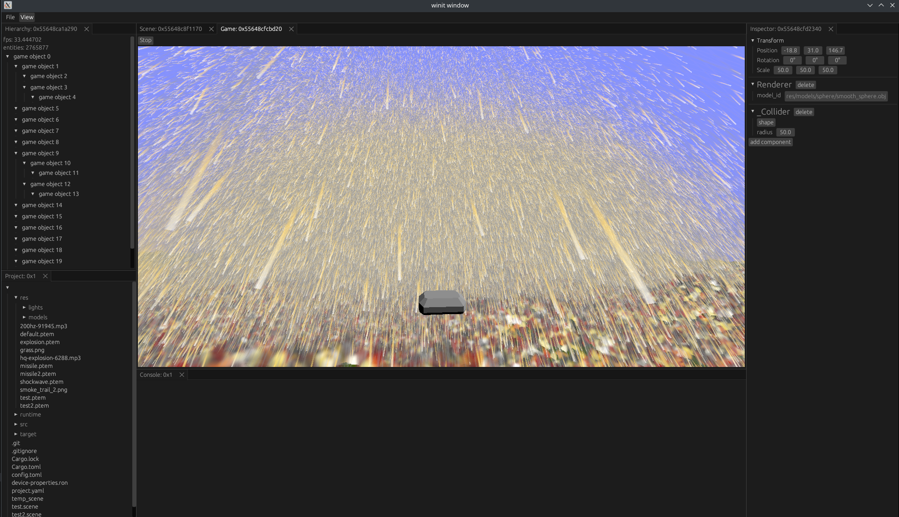

# Rust Game Engine
An engine written for high performance game applications.
- It utilizes a high level of parallelism using rayon for entity simulation, physics (rapier3d to rewrite myself for better integration) and even large gpu buffering operations to maximize memory bandwidth utilization
- provides runtime compilation for user scripting
- unity like ecs/behaviour scripting paradigm with **MUCH** better performance by default and without using an interface like Unity's Dots/burst compiler
- extremely scalable performance for multithreaded cpus
- level editor with the ability to expose component fields (to be considerably improved in the future)

## Requirements
- rust
- make
- cmake
- ninja

## Performance
On a 32 core, 64 thread Threadripper 2995 WX and a Radeon 7900 xtx, 33 fps is achievable with nearly 3 million simulated projectiles

